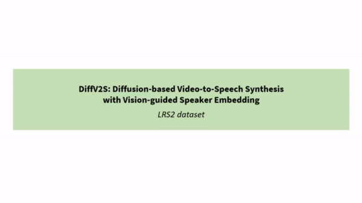

# DiffV2S: Diffusion-based Video-to-Speech Synthesis with Vision-guided Speaker Embedding

## Overview
This repository contains a video demo of IEEE/CVF International Conference on Computer Vision (ICCV) 2023 paper titled "DiffV2S: Diffusion-based Video-to-Speech Synthesis with Vision-guided Speaker Embedding".

## Demo video
A demo video contains the original speech, the generated speech from previous state-of-the-art works <a id="1">[1-3]</a>, and the generated speech from the proposed method from three different speakers on both LRS2 and LRS3 datasets, respectively. 
The video demo is located in demo-video folder in our repository, and it is also available in Youtube: 
- LRS2 and LRS3 [[Demo Video]]() 

<example>
 

  

## References
  <a id="1">[1]</a> Kim, Minsu, Joanna Hong, and Yong Man Ro. "Lip to speech synthesis with visual context attentional GAN." Advances in Neural Information Processing Systems 34 (2021): 2758-2770.

  <a id="2">[2]</a> Mira, Rodrigo, et al. "SVTS: scalable video-to-speech synthesis." arXiv preprint arXiv:2205.02058 (2022).
  
  <a id="3">[3]</a> Kim, Minsu, Joanna Hong, and Yong Man Ro. "Lip-to-speech synthesis in the wild with multi-task learning." ICASSP 2023-2023 IEEE International Conference on Acoustics, Speech and Signal Processing (ICASSP). IEEE, 2023.
  
